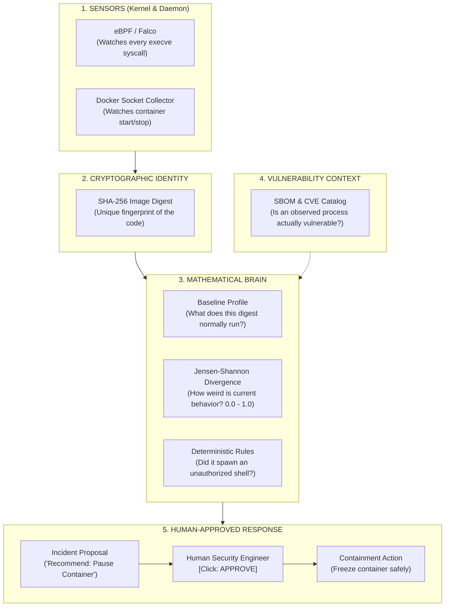
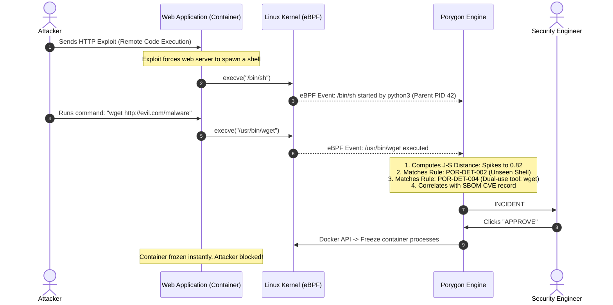

# Porygon Explained: The Ultimate Intuitive Guide to Container Security

> **For Beginners, Students, and Engineers**  
> *If you have never touched Linux kernel internals or container security before, start here. By the end of this guide, you will understand how modern operating systems run programs, how hackers exploit containers, and how Porygon catches them using mathematics and kernel probes.*

---

## The Story in One Minute (The Mental Model)

Imagine you own an automated fast-food kitchen.
* In this kitchen, you have a specialized **Burger Robot**.
* Every single day, the Burger Robot only does three things: it grabs buns, grills patties, and wraps burgers. It repeats this identical routine 10,000 times a day.
* Suddenly, at 2:00 AM, the Burger Robot opens a web browser, types in a credit card number, and attempts to email a file to an unknown address in another country.

**What just happened?**  
The robot didn't make a bad burger. The robot was **hijacked**.

Now ask yourself two fundamental questions:
1. **Did you need complicated, unpredictable "Artificial Intelligence" to know something went wrong?**  
   *No.* You simply needed to know that a burger robot should never, under any circumstance, launch a web browser.
2. **Would checking the robot's toolbox in the morning have prevented this?**  
   *No.* The robot's toolbox might contain a wrench. A wrench is useful for repairs, but a burglar can also use it to smash a lock. Just having a tool in the box doesn't tell you if a crime is happening right now.

**Porygon is the watchful security system built on this exact realization:**
In modern cloud computing, software containers (like our Burger Robot) are supposed to be **predictable and repetitive**. Instead of relying on opaque AI guesses or noisy file scanners, Porygon watches the Linux operating system directly, measures mathematically how far today's behavior deviates from yesterday's routine, and catches active break-ins with mathematical proof.

---

## Table of Contents

1. [Ground Zero: How Computers & Containers Actually Work](#1-ground-zero-how-computers--containers-actually-work)
   - [What is an Operating System Kernel?](#what-is-an-operating-system-kernel)
   - [What is a "Container" Really? (The Big Lie)](#what-is-a-container-really-the-big-lie)
2. [The Two Big Lies of Traditional Security](#2-the-two-big-lies-of-traditional-security)
   - [Lie #1: "If there's a vulnerability on disk, you've been hacked."](#lie-1-if-theres-a-vulnerability-on-disk-youve-been-hacked)
   - [Lie #2: "Black-box AI will keep you safe."](#lie-2-black-box-ai-will-keep-you-safe)
3. [The Porygon Solution: 5 Building Blocks](#3-the-porygon-solution-5-building-blocks)
   - [Block 1: eBPF — The Unblinking Kernel Camera](#block-1-ebpf--the-unblinking-kernel-camera)
   - [Block 2: Docker Lifecycle Tracking — Who is Running What?](#block-2-docker-lifecycle-tracking--who-is-running-what)
   - [Block 3: Cryptographic Digests — Why Image Tags Lie](#block-3-cryptographic-digests--why-image-tags-lie)
   - [Block 4: Jensen-Shannon Distance — The Math of "Weirdness"](#block-4-jensen-shannon-distance--the-math-of-weirdness)
   - [Block 5: The 4-Stage Vulnerability Evidence Ladder](#block-5-the-4-stage-vulnerability-evidence-ladder)
4. [Step-by-Step Anatomy of an Attack](#4-step-by-step-anatomy-of-an-attack)
5. [Why This is Unique & Paper-Worthy](#5-why-this-is-unique--paper-worthy)
6. [Can You Run It on Your Laptop? (Requirements Audit)](#6-can-you-run-it-on-your-laptop-requirements-audit)
7. [Hands-On Lab: Try It Yourself in 5 Minutes](#7-hands-on-lab-try-it-yourself-in-5-minutes)
8. [Every Jargon Term Defined Simply](#8-every-jargon-term-defined-simply)

---

## 1. Ground Zero: How Computers & Containers Actually Work

Before understanding container security, we must demystify how programs run.

### What is an Operating System Kernel?

When a program runs (like a Python script, a web browser, or a video game), it cannot talk directly to your physical computer hardware. A program cannot directly write bytes to your hard drive, send electrical pulses through your Wi-Fi card, or allocate physical RAM chips.

Instead, every program must ask permission from a central manager: the **Linux Kernel**.

```text
  ┌────────────────────────────────────────────────────────┐
  │                 User Program (e.g. Python)              │
  └───────────────────────────┬────────────────────────────┘
                              │ "Please open file /data.txt"
                              ▼ (System Call / Syscall)
  ┌────────────────────────────────────────────────────────┐
  │                      LINUX KERNEL                      │
  │  (Checks permissions, talks to hardware, manages memory)│
  └───────────────────────────┬────────────────────────────┘
                              │ Read physical disk sectors
                              ▼
  ┌────────────────────────────────────────────────────────┐
  │                   PHYSICAL HARDWARE                     │
  │                     (CPU, NVMe, RAM)                    │
  └────────────────────────────────────────────────────────┘
```

The requests a program sends to the kernel are called **System Calls (Syscalls)**:
* `openat`: "Open this file."
* `execve`: "Run this new program."
* `connect`: "Connect to this internet address."

The kernel is the absolute ruler of the computer. **Nothing happens without the kernel knowing.**

---

### What is a "Container" Really? (The Big Lie)

Many people believe a Docker container is a mini-computer or a "virtual machine" with its own operating system. **That is completely false.**

* A **Virtual Machine** emulates real hardware: it runs its own separate kernel, takes minutes to boot, and uses gigabytes of memory.
* A **Container** is just a **regular, ordinary Linux process wearing a blindfold**.

The Linux kernel puts a blindfold on a containerized process using two native features:
1. **Namespaces (What the process can SEE):** The kernel tricks the container into thinking it is the only process on the machine, giving it its own private view of the filesystem, network, and process IDs.
2. **Cgroups (What the process can USE):** The kernel limits how much CPU and RAM the process is allowed to consume.

```text
 ┌──────────────────────────────────────────────────────────────────┐
 │                         YOUR COMPUTER                            │
 │                                                                  │
 │   ┌──────────────────────┐            ┌──────────────────────┐   │
 │   │ Container A (Nginx)  │            │ Container B (Postgres)│  │
 │   │ (Process ID 1 in box)│            │ (Process ID 1 in box)│   │
 │   └──────────┬───────────┘            └──────────┬───────────┘   │
 │              │                                   │               │
 │              └─────────────────┬─────────────────┘               │
 │                                ▼                                 │
 │                     ONE SHARED LINUX KERNEL                      │
 └──────────────────────────────────────────────────────────────────┘
```

> [!IMPORTANT]
> **The Critical Security Takeaway:**  
> Because all containers share the **exact same host kernel**, if a hacker breaks out of an application inside a container, they are sitting directly on your host kernel!  
> You cannot secure a container by putting an antivirus agent *inside* the container—a hacker who gains root inside the container can simply turn off the antivirus! You must watch from the **host kernel itself**.

---

## 2. The Two Big Lies of Traditional Security

When companies try to secure their containers today, they almost always fall into two traps:

### Lie #1: "If there's a vulnerability on disk, you are in danger." (The Static Fallacy)

Security teams run scanners like Trivy or Snyk on container images. The scanner looks at every package installed in the container's files and searches a public database of known software bugs called **CVEs** (Common Vulnerabilities and Exposures).

The scanner sounds the alarm:  
*"CRITICAL ALERT: Package `libssl` has a vulnerability! Package `imagemagick` has an exploit!"*

**Why this is misleading:**
* An image might have `imagemagick` installed on its filesystem because the base Linux distribution included it.
* But your application is a simple JSON API that **never runs `imagemagick`**.
* The vulnerability is sitting on disk like an unlit match in an empty room. It cannot harm you unless something actually strikes the match (executes the code)!
* **Result:** Developers get 500 alerts per week, realize 99% are harmless, and stop reading security alerts entirely (**Alert Fatigue**).

---

### Lie #2: "A black-box AI model will magically catch attacks." (The ML Fallacy)

Newer tools deploy machine learning algorithms (like neural networks or autoencoders) that analyze server metrics and spit out a threat score:  
*"Warning: Suspicious container activity detected (Confidence: 91.4%)."*

**Why this fails in production:**
* **Unexplainable:** If a security engineer asks the AI: *"What specific action triggered this alert? What process ran?"* The model cannot answer. It only has mathematical weights.
* **The Black Friday Nightmare:** If your web store experiences a sudden holiday traffic rush, the AI sees novel traffic patterns and panics, flagging legitimate customers as attackers.
* **Result:** Nobody is brave enough to let an AI automatically stop or restart production containers, because a false alarm could shut down an entire business.

---

## 3. The Porygon Solution: 5 Building Blocks

Porygon rejects both lies. It doesn't rely on static file guesses, and it doesn't use black-box neural networks. Instead, it uses **kernel observability, cryptographic identities, and transparent information theory**.

Here are the 5 blocks that make Porygon work:



---

### Block 1: eBPF — The Unblinking Kernel Camera

**What is eBPF?**  
In the old days, to watch kernel events, developers had to write dangerous "Kernel Modules" that could crash the entire computer with a single typo.  
In modern Linux, **eBPF (Extended Berkeley Packet Filter)** allows us to run safe, sandboxed micro-programs directly inside the kernel without rebooting or risking system crashes.

* Whenever *any* process in *any* container tries to execute a new binary (`execve`), Porygon's eBPF probe (powered by Falco) immediately reads:
  - **`proc.name`**: Exactly what program was launched (e.g. `/usr/bin/python3`, `/bin/sh`).
  - **`proc.vpid`**: The process ID number inside the container.
  - **`proc.pname`**: What launched it (e.g. did `nginx` launch `sh`?).
  - **`proc.tty`**: Did a human type this into a terminal, or did a background script do it?
* **Why this is unbeatable:** The container cannot lie to the host kernel. Even if a hacker has root privileges inside the container, eBPF is watching from the host level above them.

---

### Block 2: Docker Lifecycle Tracking — Who is Running What?

When a container starts or stops, the Docker daemon broadcasts an event. Porygon's `collector` microservice listens to these events through the Docker socket.

To make sure no events are ever lost during a crash, Porygon uses the **Transactional Outbox Pattern**:
1. When Docker says *"Container A just started"*, the collector writes it into a local SQLite database immediately.
2. It then synchronizes it to the main PostgreSQL database.
3. If the network drops or the main database reboots, the outbox retains the events and replays them cleanly once the connection returns. **Zero data loss.**

---

### Block 3: Cryptographic Digests — Why Image Tags Lie

Most people run containers using image tags:
```bash
docker run my-company-app:latest
```
**Why this is dangerous:**  
The tag `:latest` is **mutable** (it can change). If a developer pushes a bug fix at 5:00 PM, `my-company-app:latest` now points to completely different code than it did at 9:00 AM! If your security baseline was built on the morning version, it will trigger false alarms on the evening version.

**Porygon's fix:**  
Porygon **never** identifies containers by human tags. It identifies them by their **immutable SHA-256 cryptographic digest**:
```text
sha256:7f3a9b8214ec084c8a2b5e9f1a23c5e88d01bc19e35a0928b9c7047f...
```
This is a mathematical fingerprint of the exact bytes of the software. If a single comma in a single file changes, the hash changes completely. Porygon binds every behavioral profile to an immutable digest.

---

### Block 4: Jensen-Shannon Distance — The Math of "Weirdness"

How does Porygon decide if a container is behaving abnormally without using black-box AI?

It uses **Information Theory**, specifically **Jensen-Shannon Divergence ($D_{JS}$)**.

Think of it like comparing two ingredient recipes:
* **Recipe $P$ (The Normal Baseline):** Built by observing the container over time.  
  $$P(\text{python3}) = 70\%, \quad P(\text{gunicorn}) = 30\%, \quad P(\text{everything else}) = 0\%$$
* **Recipe $Q$ (What we see right now in the last 5 minutes):**  
  $$Q(\text{python3}) = 50\%, \quad Q(\text{gunicorn}) = 20\%, \quad Q(\text{curl}) = 30\%$$

Porygon calculates the mathematical distance between Recipe $P$ and Recipe $Q$:
$$M = \frac{1}{2}(P + Q)$$
$$D_{JS}(P \parallel Q) = \sqrt{\frac{1}{2} D_{KL}(P \parallel M) + \frac{1}{2} D_{KL}(Q \parallel M)}$$

**Why this formula is awesome:**
* **Strictly Bounded:** The result is always a clean number between `0.00` (identical behavior) and `1.00` (completely alien behavior).
* **100% Transparent:** There are no "hidden layers." You can calculate this score by hand with a calculator.
* **Explainable:** If $D_{JS}$ spikes from `0.02` to `0.85`, Porygon points to the exact culprit: *"Binary `/usr/bin/curl` has 0% presence in baseline $P$, contributing 83% of the distance score."*

---

### Block 5: The 4-Stage Vulnerability Evidence Ladder

Instead of screaming that a container has a critical vulnerability the moment a scanner finds a file on disk, Porygon requires a vulnerability to climb a **4-stage evidence ladder**:

```text
  ┌────────────────────────────────────────────────────────────────────────┐
  │  Stage 4: runtime_observed_and_port_published                         │
  │  (The vulnerable program is running AND listening on an open port!)    │  CRITICAL
  └───────────────────────────────────▲────────────────────────────────────┘
                                      │
  ┌───────────────────────────────────┴────────────────────────────────────┐
  │  Stage 3: runtime_observed                                             │
  │  (Kernel eBPF actually saw the vulnerable code execute in memory!)     │  HIGH
  └───────────────────────────────────▲────────────────────────────────────┘
                                      │
  ┌───────────────────────────────────┴────────────────────────────────────┐
  │  Stage 2: deployed                                                     │
  │  (The container image is currently running on a server.)               │  MEDIUM
  └───────────────────────────────────▲────────────────────────────────────┘
                                      │
  ┌───────────────────────────────────┴────────────────────────────────────┐
  │  Stage 1: package_present                                              │
  │  (The file merely exists on the hard drive inside the image.)          │  INFORMATIONAL
  └────────────────────────────────────────────────────────────────────────┘
```

If a vulnerability is only at Stage 1 or Stage 2, Porygon categorizes it as:  
`exploit_status = not_established`.

Only when kernel probes observe the binary executing (Stage 3 or 4) alongside anomalous behavioral distance does Porygon correlate it into an active security incident.

---

## 4. Step-by-Step Anatomy of an Attack

Let's watch what happens during a real cyberattack:



---

## 5. Why This is Unique & Paper-Worthy

If you or your friends want to write a scientific paper, present at conferences, or cite this project in an academic thesis, here is why Porygon stands apart from commercial tools:

1. **The Profile Scope Experiment**:  
   Porygon is designed to test a formal scientific hypothesis: *How specific should a baseline profile be?*
   - `ARM-GLOBAL`: One profile for the whole computer.
   - `ARM-TAG`: Profile per human tag (e.g. `python:3.11`).
   - `ARM-DIGEST`: Profile per cryptographic SHA-256 hash.
   - `ARM-CONTEXT`: Profile per hash + security permissions (privileged flags, ports).  
   Porygon measures exactly how much false alarms drop across these four arms.
2. **Pre-Registered Falsification Boundaries**:  
   In [`docs/CLAIMS_V1.md`](file:///home/anuruprkris/Project/Porygon/docs/CLAIMS_V1.md), Porygon adheres to strict scientific hygiene: if an experiment fails to reduce false positives by a statistically significant margin, the project is required to report the negative result.
3. **Provably Lossless Pipeline**:  
   Rather than hoping eBPF never drops packets, Porygon has automated saturation tests (`scripts/verify_all.sh`) that bombard the system with thousands of rapid executions and prove that the count in PostgreSQL matches the kernel event count 100%.

---

## 6. Can You Run It on Your Laptop? (Requirements Audit)

> [!TIP]
> **You do NOT need AWS, GCP, Azure, or any cloud server.** In fact, running Porygon on your personal Linux PC is **faster and better** than on cloud virtual machines!

### Why Local Linux Beats the Cloud for eBPF
Many cloud virtual machines run on stripped-down kernels where eBPF headers (`/sys/kernel/btf/vmlinux`) are disabled. On your native Linux computer, you have full, direct hardware access to kernel tracepoints.

### Quick Compatibility Checklist

| What Porygon Needs | What It Means | How to Check on Your PC |
|---|---|---|
| **64-bit Linux** | Ubuntu, Arch, Fedora, Debian, CachyOS, etc. | `uname -s -m` |
| **Linux Kernel $\ge$ 5.8** | Modern kernel with BTF symbols | `test -f /sys/kernel/btf/vmlinux && echo "OK!"` |
| **Docker Engine & Compose** | Container runtime | `docker --version && docker compose version` |
| **RAM: $\ge$ 4 GB** | Porygon uses $\approx$ 1.5 GB | `free -h` |
| **Disk: $\ge$ 10 GB** | Storing images and database tables | `df -h .` |

---

## 7. Hands-On Lab: Try It Yourself in 5 Minutes

Here is a foolproof recipe you and your friends can run right now:

### Step 1: Clone the Repo
```bash
git clone https://github.com/Anurup-R-Krishnan/Porygon.git
cd Porygon
```

### Step 2: Initialize Configuration
```bash
make init
```
*This automatically generates a `.env` file with secure random passwords and configures permissions for your Docker socket.*

### Step 3: Launch the Entire System
```bash
make up
```
*Docker will download and build all 7 microservices. Once done, verify they are running:*
```bash
make ps
```

### Step 4: Open the Web Dashboard
Open your web browser to:
👉 **[http://127.0.0.1:8000/docs](http://127.0.0.1:8000/docs)**  
*(You will see the live interactive Swagger API where you can query scans, baselines, and incidents!)*

---

### Step 5: Trigger a Real Anomaly & Watch Porygon Catch It!

Open your terminal and run this 60-second experiment:

1. **Start a clean, harmless container:**
   ```bash
   docker run -d --name lab-target alpine:3.19 sh -c 'while true; do sleep 5; done'
   ```

2. **Check its baseline profile:**
   ```bash
   ./scripts/porygon_baseline.py list
   ```
   *(Notice that Porygon recorded this container only running `sh` and `sleep`.)*

3. **Now pretend you are an attacker who broke in:**
   ```bash
   # Run an unexpected network tool inside the container!
   docker exec -it lab-target wget -qO- https://example.com || true
   docker exec -it lab-target nc -h || true
   ```

4. **Ask Porygon to compute the anomaly score:**
   ```bash
   CONTAINER_ID=$(docker ps -qf "name=lab-target")
   ./scripts/porygon_score.py evaluate --container-id "$CONTAINER_ID"
   ```
   * **Look at the output:** The Jensen-Shannon distance will spike from `0.00` to over `0.70`!

5. **View the detected security incident:**
   ```bash
   ./scripts/porygon_detect.py incidents
   ```
   * **Result:** Porygon has opened an incident flagging `POR-DET-004: Novel Dual-Use Tool (wget, nc)` and issued a recommendation to freeze the container!

6. **Clean up your test container:**
   ```bash
   docker rm -f lab-target
   ```

---

## 8. Every Jargon Term Defined Simply

* **Kernel**: The master program of the operating system that controls all hardware and permissions.
* **Syscall (System Call)**: A polite request from a normal program to the kernel asking to open a file, launch a process, or send network data.
* **eBPF**: A secure virtual engine inside the Linux kernel that lets us attach monitoring probes to any kernel event with zero speed loss.
* **Container**: A normal Linux process isolated from other processes using kernel namespaces (blindfolds) and cgroups (resource limits).
* **Image Digest**: A mathematical SHA-256 fingerprint of a container's files that never changes, unlike mutable tags like `:latest`.
* **SBOM (Software Bill of Materials)**: An itemized receipt listing every software library installed inside a container image.
* **CVE**: A public ID number for a known security bug in software (e.g. `CVE-2024-1234`).
* **EPSS**: A score from 0% to 100% predicting the probability that a CVE will be exploited in the wild in the next 30 days.
* **CISA KEV**: A catalog of vulnerabilities officially confirmed to be currently exploited by real-world threat actors.
* **Jensen-Shannon Divergence**: An information-theory formula that measures how different two probability distributions are, outputting a clean number between `0.0` (identical) and `1.0` (totally different).
* **Outbox Pattern**: Saving messages in a local database before sending them over the network, so no data is lost if the network drops.

---

*Written by Anurup R Krishnan | [Porygon on GitHub](https://github.com/Anurup-R-Krishnan/Porygon)*
