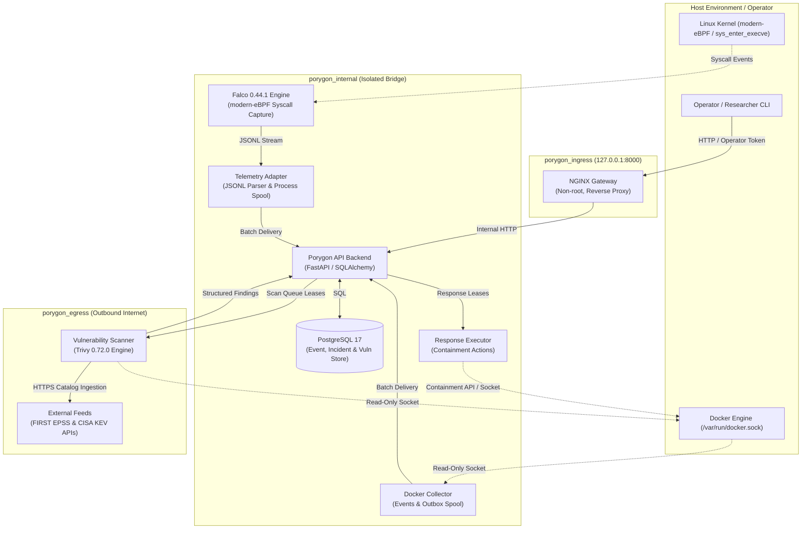
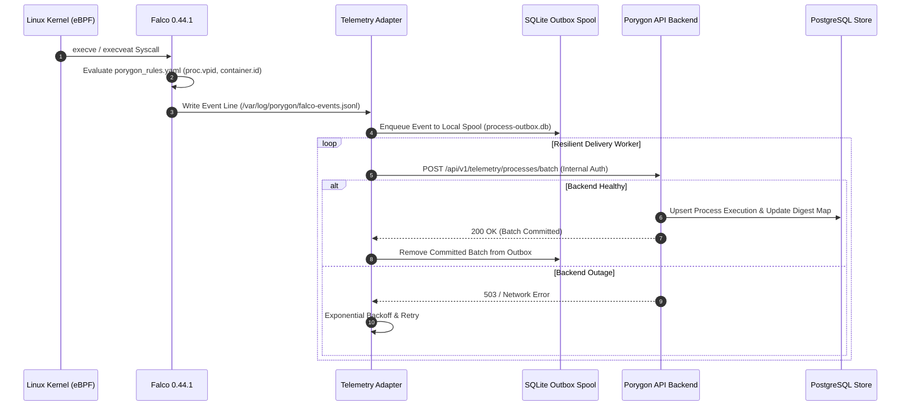
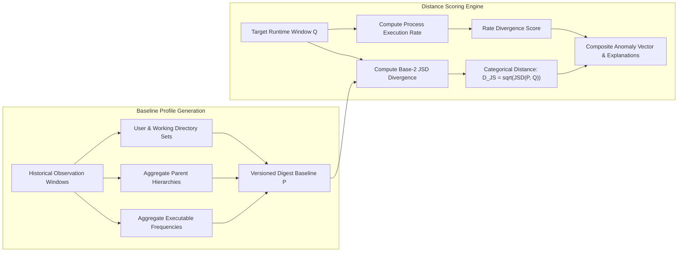
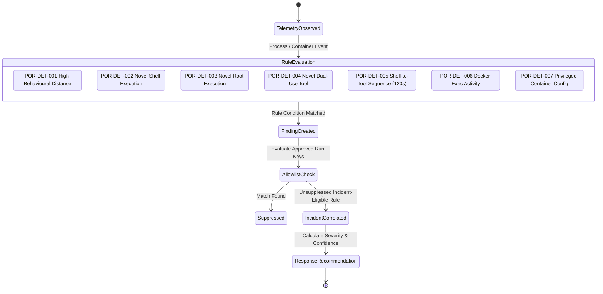
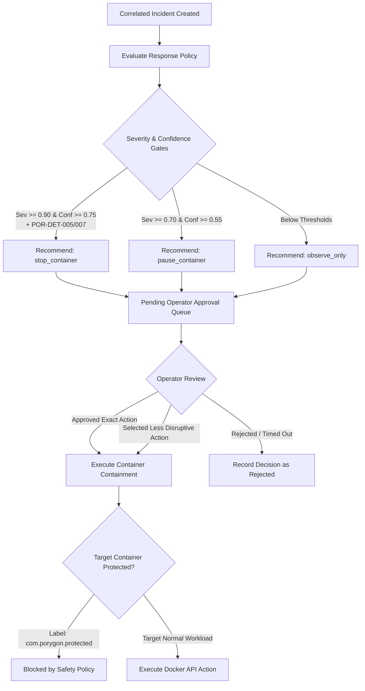
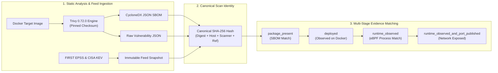

# Porygon

> **Docker-First Runtime Security, Behavioural Anomaly Detection & Vulnerability Intelligence Platform**
>
> Porygon is an extensible runtime-security research platform for containerized Linux environments. It couples kernel-level process telemetry (via modern eBPF) with Docker daemon lifecycle events to construct immutable digest-bound behavioural baselines, compute explainable Jensen-Shannon behavioural distance anomalies, correlate deterministic security findings into actionable incidents, enforce human-approved container containment policies, and cross-reference container image digests with cryptographically verified SBOMs and multi-dimensional vulnerability intelligence (EPSS & CISA KEV).

---

## Table of Contents

- [System Architecture & Network Boundaries](#system-architecture--network-boundaries)
- [Core Subsystems & Capabilities](#core-subsystems--capabilities)
- [Telemetry & Kernel Event Ingestion](#telemetry--kernel-event-ingestion)
- [Behavioural Profiling & Anomaly Scoring](#behavioural-profiling--anomaly-scoring)
- [Deterministic Detection & Incident Correlation](#deterministic-detection--incident-correlation)
- [Automated & Human-Approved Response Policies](#automated--human-approved-response-policies)
- [Vulnerability & SBOM Intelligence Pipeline](#vulnerability--sbom-intelligence-pipeline)
  - [Exact Canonical Scan Identity](#exact-canonical-scan-identity)
  - [Scanner Supply-Chain Controls](#scanner-supply-chain-controls)
  - [Multi-Stage Evidence Model](#multi-stage-evidence-model)
  - [Historical Evidence Reproducibility](#historical-evidence-reproducibility)
- [Repository Structure](#repository-structure)
- [Prerequisites & System Requirements](#prerequisites--system-requirements)
- [Configuration & Environment Setup](#configuration--environment-setup)
- [Running the Platform](#running-the-platform)
- [Operator CLI Workflows](#operator-cli-workflows)
- [Verification & Quality Assurance Gates](#verification--quality-assurance-gates)
- [Documentation Index](#documentation-index)

---

## System Architecture & Network Boundaries

Porygon enforces strict network segregation, minimal privilege boundaries, and defence-in-depth across its containerized services.

### Network Topology & Data Flow



### Security Boundaries & Privilege Segregation

| Component | Network Attachments | Socket Access | Credentials Held | Capabilities / Permissions |
|---|---|---|---|---|
| **NGINX Gateway** | `porygon_ingress`, `porygon_internal` | None | None (Credential-free) | `cap_drop: ALL`, unprivileged UID |
| **API Backend** | `porygon_internal` | None | PostgreSQL & Service Tokens | `cap_drop: ALL`, `read_only: true` |
| **PostgreSQL** | `porygon_internal` | None | PostgreSQL Internal Credentials | Persistent named volume |
| **Docker Collector** | `porygon_internal` | `/var/run/docker.sock` *(ro)* | Internal Service API Token | Read-only socket, SQLite local outbox |
| **Falco (eBPF)** | `porygon_internal` | `/var/run/docker.sock` *(ro)* | None | `BPF`, `PERFMON`, `SYS_RESOURCE`, `SYS_PTRACE` |
| **Telemetry Adapter** | `porygon_internal` | None | Internal Service API Token | Read-only shared event volume, SQLite outbox |
| **Response Executor** | `porygon_internal` | `/var/run/docker.sock` *(ro/rw)* | Internal Service API Token | Docker socket for pause/stop actions |
| **Vulnerability Scanner** | `porygon_internal`, `porygon_egress` | `/var/run/docker.sock` *(ro)* | Internal Service API Token | Outbound HTTPS for threat feeds & DB updates |

---

## Core Subsystems & Capabilities

| Subsystem | Architecture & Purpose | Implementation Highlights |
|---|---|---|
| **Core API & State Management** | Centralized FastAPI service managing database schemas, migrations, service authentication, and event ingestion. | SQLAlchemy ORM, Alembic schema migrations, strict role-based token authentication (Operator vs Internal). |
| **Docker Telemetry Ingestion** | Captures container lifecycle events (`create`, `start`, `die`, `exec`) and records immutable image identities. | SQLite-backed durable outbox with exponential backoff retry and exactly-once deduplication. |
| **Kernel Process Telemetry** | Captures container process executions via modern eBPF without host kernel module dependencies. | Falco 0.44.1 engine with `proc.vpid` field validation, networkless volume permission initializers, and JSONL adapters. |
| **Digest-Bound Baselines** | Constructs immutable, versioned behavioural profiles bound strictly to repository digests. | Aggregates observed executables, parent trees, working directories, and user identities. |
| **Behavioural Distance Scoring** | Computes explainable Jensen-Shannon divergence anomalies between runtime windows and baselines. | Math-grounded categorical divergence, continuous rate scoring, rarity weights, and provenance metrics. |
| **Deterministic Detections** | Correlates security findings across multi-call binaries, shell executions, and privilege escalations. | Multicall applet-aware matching (`BusyBox`, `Toybox`), deterministic rule identifiers (`POR-DET-001`..`007`). |
| **Controlled Response Engine** | Executes human-approved mitigation actions against target containers. | Support for `observe_only`, `pause_container`, and `stop_container` with `com.porygon.protected` guardrails. |
| **Vulnerability Intelligence** | Enriches container image digests with CycloneDX SBOMs, CVE mappings, EPSS exploit likelihoods, and CISA KEV context. | Trivy 0.72.0 pinned engine, 6-parameter canonical scan SHA-256 identity, and multi-stage runtime reachability models. |

---

## Telemetry & Kernel Event Ingestion

Porygon employs a decoupled, durable telemetry architecture to ensure zero loss of kernel-observed process events or container lifecycle state during backend outages.



### Falco eBPF Rule Configuration

Process monitoring is governed by [`falco/porygon_rules.yaml`](falco/porygon_rules.yaml):

```yaml
- rule: Porygon Container Process Execution
  desc: Record each process execution observed inside a Linux container for digest-bound behavioural profiling.
  condition: evt.type in (execve, execveat) and container.id != host
  output: "Porygon container process execution (evt_time=%evt.time.iso8601 evt_rawtime=%evt.rawtime evt_num=%evt.num evt_type=%evt.type container_id=%container.id container_name=%container.name image_repository=%container.image.repository image_tag=%container.image.tag pid=%proc.pid ppid=%proc.ppid vpid=%proc.vpid process=%proc.name executable=%proc.exepath command=%proc.cmdline cwd=%proc.cwd terminal=%proc.tty parent=%proc.pname parent_executable=%proc.pexepath parent_command=%proc.pcmdline user_uid=%user.uid user=%user.name group_gid=%group.gid group=%group.name)"
  priority: NOTICE
  source: syscall
  tags: [porygon, container, process]
```

> [!NOTE]
> **Kernel Compatibility**: On specialized kernels (e.g. CachyOS), Falco may report certain optional TOCTOU mitigation tracepoints as unavailable while continuing reliable process execution capture. Stock Linux LTS kernels are used for formal experimental baselines.

---

## Behavioural Profiling & Anomaly Scoring

Porygon models container runtime behaviour using mathematical distance measures rather than black-box machine learning classifiers.



### Mathematical Foundations (`porygon.distance.v1`)

1. **Categorical Feature Distance**:
   For each categorical dimension (executables, parent binaries, user UIDs, working directories, terminal attachments), the baseline distribution $P$ and observation distribution $Q$ are evaluated using Jensen-Shannon Divergence:
   $$M = \frac{1}{2}(P + Q)$$
   $$JSD(P, Q) = \frac{1}{2} D_{KL}(P \parallel M) + \frac{1}{2} D_{KL}(Q \parallel M)$$
   $$D_{JS}(P, Q) = \sqrt{JSD(P, Q)}$$

2. **Numerical Rate Distance**:
   Process execution rates per minute are evaluated against baseline normal curves using bounded logarithmic scaling.

3. **Calibrated Provenance & Rarity**:
   Unseen executables receive calibrated rarity weights based on global repository frequencies, distinguishing standard utilities from novel binaries.

---

## Deterministic Detection & Incident Correlation

Findings are generated deterministically using the `porygon.detection.v1` ruleset (matcher `porygon.detection.matcher.v3`).



### Deterministic Detection Rules

| Rule ID | Name | Trigger Condition | Incident Eligible | Allowlistable |
|---|---|---|:---:|:---:|
| **POR-DET-001** | High Behavioural Distance | Total anomaly distance $\ge 0.50$ | No *(Informational)* | No |
| **POR-DET-002** | Previously Unseen Shell | Known shell binary (`sh`, `bash`, `ash`, `zsh`) absent from baseline | **Yes** | **Yes** *(Digest + Executable)* |
| **POR-DET-003** | Novel Root Process | Process executed with UID 0 where UID 0 was absent in baseline | **Yes** | **Yes** *(Digest + Executable)* |
| **POR-DET-004** | Novel Dual-Use Tool | Unseen network/utility binary (`curl`, `wget`, `nc`, `socat`, `base64`, `openssl`, `python`, `perl`) | **Yes** | **Yes** *(Digest + Executable)* |
| **POR-DET-005** | Shell-to-Tool Sequence | Novel shell followed by novel dual-use tool within 120 seconds in same container | **Yes** | Derived *(Source suppression)* |
| **POR-DET-006** | Docker Exec Activity | `exec_create` / `exec_start` observed in score window | No *(Contextual)* | No |
| **POR-DET-007** | Privileged Configuration | Container created/started with privileged mode enabled | **Yes** | No |

---

## Automated & Human-Approved Response Policies

Porygon implements human-in-the-loop remediation via policy `porygon.response.v1`. Recommended containment actions must receive explicit human operator approval before execution.



### Action Criteria & Safeguards

- **`observe_only`**: Logs findings without altering container runtime state.
- **`pause_container`**: Suspends all processes in the exact container ID ($Severity \ge 0.70$, $Confidence \ge 0.55$).
- **`stop_container`**: Initiates graceful container shutdown ($Severity \ge 0.90$, $Confidence \ge 0.75$, requires strong correlation).
- **Prohibited Operations**: Porygon will **never** delete images, delete volumes, wipe containers, execute remote commands inside containers, or modify host firewall rules. Containers with `com.porygon.protected=true` are strictly immune to response actions.

---

## Vulnerability & SBOM Intelligence Pipeline

Porygon extends runtime observation by binding container image digests directly to static Software Bill of Materials (SBOM) and vulnerability threat feeds.



### Exact Canonical Scan Identity

Scans are identified by a deterministic canonical SHA-256 hash:

```text
canonical_scan_identity = SHA-256(
    repository_digest        + "\n" +
    exact_local_image_id     + "\n" +
    docker_host              + "\n" +
    scanner_name_and_version + "\n" +
    vulnerability_schema_ver + "\n" +
    researcher_scan_reference
)
```

- **Idempotent**: Resubmitting identical parameters returns existing records without re-running scans.
- **Immutable**: Modifications to image digests, scanner versions, or researcher references spawn distinct, immutable scan records.

### Scanner Supply-Chain Controls

Trivy binaries are locked to version `0.72.0` with verified release checksums:

| Architecture | Release Archive SHA-256 Checksum |
|---|---|
| **amd64 (x86_64)** | `bbb64b9695866ce4a7a8f5c9592002c5961cab378577fa3f8a040df362b9b2ea` |
| **arm64 (aarch64)** | `2ca2c023109c2db6b2b77366b6717291452d4531167377d95c79547f0c8e3467` |

### Multi-Stage Evidence Model

| Evidence Stage | Description |
|---|---|
| `package_present` | Package/version metadata matched in the static image filesystem. |
| `deployed` | An active container running the exact image digest has been observed on the daemon. |
| `runtime_observed` | Kernel eBPF telemetry observed a process whose name/path heuristically matches the package. |
| `runtime_observed_and_port_published` | Process execution matched and a public network port is exposed on the host. |

> [!WARNING]
> **Exploitation Claim Boundary**: Every finding records `exploit_status = not_established`. Static package matches, EPSS scores, CISA KEV listings, or published ports demonstrate exposure context, **not** proof of reachability or active exploitation.

### Historical Evidence Reproducibility

- `vulnerability_intel`: Stores current, live threat intelligence lookups per CVE.
- `vulnerability_finding`: Stores an **immutable scan-time snapshot** (EPSS score, percentile, KEV membership, source metadata, feed hashes, and timestamps). Intelligence updates never modify previously recorded experimental data.

---

## Repository Structure

```text
Porygon/
├── compose.yaml                      # Multi-service container definitions & isolated networks
├── Makefile                          # Unified build, lint, test, and verification tasks
├── backend/                          # FastAPI core API & database migrations
│   ├── alembic/versions/             # Database schema migrations (0001 through 0009)
│   ├── src/porygon_api/
│   │   ├── baseline.py               # Behavioural profile baseline engine
│   │   ├── scoring.py                # Jensen-Shannon anomaly scoring engine
│   │   ├── detection.py              # Finding & incident correlation rules
│   │   ├── response.py               # Response recommendation & approval policy
│   │   ├── vulnerability.py          # Vulnerability, EPSS, KEV & SBOM cataloging
│   │   ├── models.py                 # SQLAlchemy ORM database models
│   │   ├── schemas.py                # Pydantic request & response schemas
│   │   └── main.py                   # API routes & middleware
│   └── tests/                        # Backend unit & integration test suite
├── collector/                        # Docker daemon event collector & SQLite outbox
├── gateway/                          # NGINX reverse proxy configuration (port 8000)
│   └── nginx.conf
├── telemetry/                        # eBPF / Falco event consumer & SQLite outbox
├── responder/                        # Containment & mitigation action executor
├── scanner/                          # SBOM & vulnerability scanner worker
│   ├── Dockerfile                    # Pinned Trivy 0.72.0 verification
│   ├── src/porygon_scanner/          # Scan queue consumer & feed fetcher
│   └── tests/                        # Scanner unit tests
├── falco/                            # Falco modern-eBPF rule definitions
│   └── porygon_rules.yaml
├── docs/                             # Architecture specs, threat models & research protocols
├── scripts/                          # Operator CLI tools & automated test suites
│   ├── porygon_baseline.py           # Baseline profile management CLI
│   ├── porygon_score.py              # Anomaly scoring CLI
│   ├── porygon_detect.py             # Incident correlation CLI
│   ├── porygon_respond.py            # Response execution CLI
│   ├── porygon_scan.py               # Vulnerability & SBOM scan CLI
│   └── verify_all.sh                 # Master verification script
└── artifacts/                        # Verification outputs, test logs & SBOM exports
```

---

## Prerequisites & System Requirements

- **Operating System**: Linux kernel with BTF enabled (`/sys/kernel/btf/vmlinux`).
- **Container Engine**: Docker Engine 24.0+ and Docker Compose v2.
- **Kernel Tracing**: Support for modern eBPF (no out-of-tree kernel modules required).
- **Socket Permissions**: Read permissions for `/var/run/docker.sock`.
- **Outbound Connectivity**: HTTPS access from the scanner container to Trivy vulnerability databases, FIRST EPSS API, and CISA KEV feeds.
- **Host Tools**: `curl`, `python3` (with PyYAML), `ruff`, `make`, `stat`, and `uname`.

---

## Configuration & Environment Setup

### 1. Initialize Secrets & Local Environment

Run the automated initializer to create a secure, non-committed `.env` file with unique cryptographic secrets and your local Docker socket GID:

```bash
make init
```

*To configure manually, copy `.env.example` to `.env`, populate all placeholders, and retrieve your Docker GID with `stat -c '%g' /var/run/docker.sock`.*

### 2. Verify Operational Safeguards

Review key configuration variables in `.env`:

```env
# Safety default: Response actions are disabled unless explicitly running lab experiments
PORYGON_RESPONSE_EXECUTION_MODE=disabled

# Trivy scanner engine version
PORYGON_TRIVY_VERSION=0.72.0

# Calibrated anomaly scoring flag
PORYGON_CALIBRATED_ENABLED=false
```

---

## Running the Platform

### Start Services

```bash
# 1. Validate Docker Compose configuration
make config

# 2. Build and start all services in detached mode
make up

# 3. Verify service health and readiness
make ps
```

### Interactive API Documentation

Access the interactive OpenAPI Swagger UI via the gateway:

- **Swagger UI**: [http://127.0.0.1:8000/docs](http://127.0.0.1:8000/docs)
- **ReDoc**: [http://127.0.0.1:8000/redoc](http://127.0.0.1:8000/redoc)

---

## Operator CLI Workflows

### 1. Deploy & Observe Target Workload

```bash
# Start a target workload
docker pull alpine:3.19
docker run -d --name porygon-target alpine:3.19 sh -c 'while :; do sleep 30; done'

# Retrieve immutable repository digest
docker image inspect alpine:3.19 --format '{{index .RepoDigests 0}}'
```

### 2. Queue a Vulnerability & SBOM Scan

```bash
export PORYGON_OPERATOR_API_TOKEN='<operator-token-from-.env>'

./scripts/porygon_scan.py create \
  --image-digest 'alpine@sha256:...' \
  --requested-by 'researcher-name' \
  --scan-reference 'experiment-001' \
  --note 'Approved baseline enrichment run'
```

### 3. Inspect Scan Outputs, SBOMs & Threat Intel

```bash
# List completed scans
./scripts/porygon_scan.py scans --status completed

# Inspect detailed scan summary
./scripts/porygon_scan.py scan <SCAN_ID>

# Export CycloneDX JSON SBOM
./scripts/porygon_scan.py sbom <SCAN_ID> > artifacts/scan-sbom.json

# Export raw Trivy report
./scripts/porygon_scan.py report <SCAN_ID> > artifacts/scan-trivy-report.json

# Query correlated package findings for an image digest
./scripts/porygon_scan.py findings --image-digest 'alpine@sha256:...'

# Query live threat intelligence for a CVE
./scripts/porygon_scan.py intel CVE-2025-12345
```

### 4. Manage Baselines, Anomaly Scores & Incidents

```bash
# List active behavioural profiles
./scripts/porygon_baseline.py list

# Compute behavioural distance anomaly score
./scripts/porygon_score.py evaluate --container-id <CONTAINER_ID>

# Review correlated security incidents & timelines
./scripts/porygon_detect.py incidents
```

---

## Verification & Quality Assurance Gates

Porygon maintains comprehensive test coverage across static linting, unit test suites, resilient live pipelines, and container containment gates.

### Verification Targets

```bash
# 1. Run full master non-disruptive gate (static, unit, live-safe, scanner)
make verify

# 2. Run static linters, YAML/TOML validators, and schema checks
make verify-static

# 3. Run all service unit test suites
make verify-unit

# 4. Run safe live integration tests (event capture, replay, baselines, incidents)
make verify-live-safe

# 5. Run live vulnerability scanner & enrichment suite
make verify-scanner-live

# 5b. Real-container acceptance: pinned digest, disposable container, reconciled telemetry
make verify-experiment-live

# 6. Validate the dependency-free experiment artifact contract (synthetic)
make experiment-smoke
make experiment-replay RUN_DIR=artifacts/experiments/local/smoke-fixture

# 7. Run a real-container pilot against pinned image digests (requires `make up`)
make experiment-pilot PILOT_ARGS="--workloads WL-NGX-V1 --scenarios SCN-EXEC --replicas 1"
make experiment-validate RUN_DIR=artifacts/experiments/local/<run-id>
```

> [!WARNING]
> **Evidence classes are not interchangeable.** The smoke fixture is synthetic.
> The pilot uses real containers but is collected while the research protocol is
> review-pending. Both record `research_eligible: false`. Only a confirmatory run
> — which the runner refuses to start until the protocol is frozen by independent
> security and methodology review — may support a research claim.

> [!IMPORTANT]
> **Controlled Disruptive Response Gate**: The live response test (`make verify-response-live`) pauses and stops containers. It requires `PORYGON_RESPONSE_EXECUTION_MODE=live` in `.env` and must only be executed in an isolated test environment. It is never included in `make verify`.

### Master Verification Pipeline Lifecycle

The verification suite (`./scripts/verify_all.sh`) validates an 11-stage operational lifecycle:
1. Validates and starts the multi-service stack with health checks.
2. Asserts claim-boundary policies (`exploit_status = not_established`).
3. Deploys disposable, non-exploit test containers.
4. Confirms immutable digest registration in PostgreSQL via collector outbox.
5. Queues exact digest and image scan jobs.
6. Proves idempotent behavior on duplicate scan requests.
7. Renews background worker leases during active scans.
8. Enriches findings with Trivy CycloneDX SBOMs, CVE mappings, FIRST EPSS, and CISA KEV feeds.
9. Validates raw-report, CycloneDX, and database hashes against preserved outputs.
10. Validates immutable scan-time intelligence snapshots and finding stages.
11. Confirms that modifying experiment references generates distinct scan identities.

### Current verification notes

Service unit suites pass 112 tests (backend 74, telemetry 20, collector 8,
responder 5, scanner 5). The stdlib-only experiment harness adds 41 tests, which
`make verify-unit` now runs on the host.

The local experiment smoke fixture is synthetic and validates artifact
provenance and replay only. The real-container pilot runner exercises the whole
capture path against pinned image digests, but pilot data is still not research
evidence. Confirmatory collection remains prohibited while the research protocol
is review-pending. See [`docs/execution-status.md`](docs/execution-status.md) for
the evidence-based module matrix and the current blockers.

Additionally validated during CI/CD checks:
- Python linting and code style via **Ruff**
- Static typing and CLI compilation
- Shell script syntax verification
- Docker Compose and Falco rule YAML validation
- Configuration TOML validation
- OpenAPI JSON schema generation
- Complete database migration chain (`0001_initial` through `0009_calibrated_rarity_provenance`)

---

## Documentation Index

For in-depth architectural specifications, threat models, and research protocols:

- **Pilot Results UI**: `artifacts/results.html` — regenerate with `python3 scripts/render_results.py`
- **Implementation Status Matrix (evidence-based)**: [`docs/execution-status.md`](docs/execution-status.md)
- **Design Decisions & Trade-offs**: [`docs/design-decisions.md`](docs/design-decisions.md)
- **Demonstration Path**: [`docs/DEMO.md`](docs/DEMO.md)
- **Verification Report**: [`docs/final-verification-report.md`](docs/final-verification-report.md)
- **System Architecture**: [`docs/PHASE8_ARCHITECTURE.md`](docs/PHASE8_ARCHITECTURE.md)
- **Vulnerability Evidence Model**: [`docs/VULNERABILITY_EVIDENCE_MODEL_V1.md`](docs/VULNERABILITY_EVIDENCE_MODEL_V1.md)
- **Threat Model & Security Boundary Analysis**: [`docs/THREAT_MODEL_V1.md`](docs/THREAT_MODEL_V1.md)
- **Detection & Correlation Ruleset**: [`docs/DETECTION_RULESET_V1.md`](docs/DETECTION_RULESET_V1.md)
- **Response Policy & Guardrails**: [`docs/RESPONSE_POLICY_V1.md`](docs/RESPONSE_POLICY_V1.md)
- **Behavioural Distance Scoring Model**: [`docs/SCORING_MODEL_V1.md`](docs/SCORING_MODEL_V1.md) & [`docs/SCORING_MODEL_CALIBRATED.md`](docs/SCORING_MODEL_CALIBRATED.md)
- **Research Protocol & Experimental Design**: [`docs/RESEARCH_PROTOCOL_V1.md`](docs/RESEARCH_PROTOCOL_V1.md)
- **Experiment Reproducibility**: [`docs/EXPERIMENT_REPRODUCIBILITY.md`](docs/EXPERIMENT_REPRODUCIBILITY.md)
- **Phase 9 Acceptance Boundary**: [`docs/EXPERIMENT_ACCEPTANCE.md`](docs/EXPERIMENT_ACCEPTANCE.md)
- **Audit & Subsystem Verification Reports**: [`docs/AUDIT_REPORT_PHASES_1_7.md`](docs/AUDIT_REPORT_PHASES_1_7.md)
